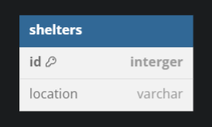
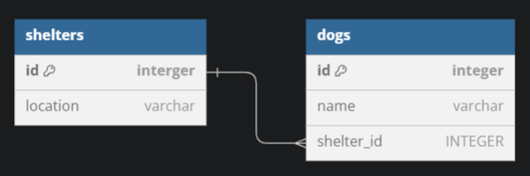
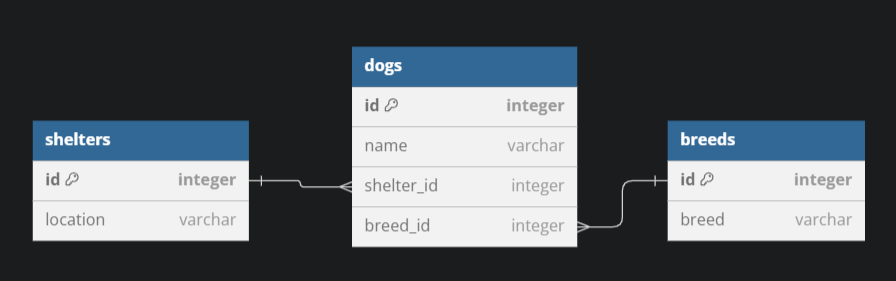

# Creating Our Dog Shelter App

In this readme, I'm going to show an approach where I only add the minimum requirements necessary to pass a single phase.

I find it is simpler to add more columns or tables to a schema than it is to remove from a schema.


**Requirements**
- Phase 1: I want to be able to find all shelters and see their location.
- Phase 2: I want to be able to find all dogs and see what shelter they're at.
- Phase 3: I want to be able to know what breed of dogs are at each shelter.
- Phase 4: I want to be able to remove an entire breed of dog for a shelter.


## Phase 1

**I want to be able to find all shelters and see their location.**

What is needed?
- "find all shelters"
- "see their location"


### Schema
- Tables: `shelters`
- Columns: `id`, `location`




### Code needed

```SQL
DROP TABLE IF EXISTS shelters;

CREATE TABLE
    shelters (
        id INTEGER PRIMARY KEY AUTOINCREMENT,
        location VARCHAR(50)
    );

INSERT INTO
    shelters
VALUES
    (1, 'DFW'),
    (2, 'Fort Worth'),
    (3, 'Waco'),
    (4, 'Tyler');

SELECT
    location
FROM
    shelters;
```

## Phase 2

**I want to be able to find all dogs and see what shelter they're at.**

What do I need to add to phase 1?
- "find all dogs"
- "see their shelter" (relationship)

### Schema
One To Many: A shelter can have many dogs
- Tables: `shelters`, `dogs`
- Columns: `shelters.id`, `shelters.location`, `dogs.id`, `dogs.name`, `dogs.shelter_id`




### Minimum Code needed

```SQL
-- I need a dogs table now
DROP TABLE IF EXISTS dogs;

-- Previous Phase 1 Code Here --

-- Add the minimum required for this phase
-- I can always add more later.
CREATE TABLE dogs(
    id INTEGER PRIMARY KEY AUTOINCREMENT,
    name VARCHAR(50), -- I'm including a name so that I don't have to refer to dogs by an ID in real life.
    shelter_id INTEGER,
    FOREIGN KEY (shelter_id) REFERENCES shelters(id)
);

INSERT INTO dogs
VALUES
(1, 'Fido', 1),
(2, 'Lucky', 1),
(3, 'Roofus', 2);

-- Now we can show every dog and their location
SELECT dogs.name, location FROM shelters
JOIN dogs
ON dogs.shelter_id = shelters.id;

```


## Phase 3

**I want to be able to know what breed of dogs are at each shelter.**

Is there anything new that I'll need?
- Yes: a way to find a breed of dog.

### Schema
What can I add to accomplish this?
- Table: `breeds`
- Columns: `dogs.breed_id`, `breeds.id`, `breeds.breed`




### Minimum Code needed
```SQL

-- Previous Code Above--

-- need to add a breeds table
CREATE TABLE
    breeds (
        id INTEGER PRIMARY KEY AUTOINCREMENT,
        breed VARCHAR(50)
    );

-- I now need to update my dogs table to include a breed_id column
CREATE TABLE
    dogs (
        id INTEGER PRIMARY KEY AUTOINCREMENT,
        name VARCHAR(50),
        breed_id VARCHAR(50),
        shelter_id INTEGER,
        FOREIGN KEY (shelter_id) REFERENCES shelters (id), FOREIGN KEY (breed_id) REFERENCES breeds (id)
    );

-- populate the breeds table
INSERT INTO
    breeds
VALUES
    (1, 'Golden'),
    (2, 'Lab'),
    (3, 'Lab'),
    (4, 'Pug'),
    (5, 'Golden');

-- populate the dogs table with breeds
INSERT INTO
    dogs
VALUES
    (1, 'Fido', 1, 1),
    (2, 'Lucky', 2, 2),
    (3, 'Roofus', 3, 3),
    (4, 'Spud', 3, 4),
    (5, 'Spud', 4, 5);


-- Prints the dog's breed and their location
SELECT
    breeds.breed,
    location
FROM
    breeds
    JOIN dogs ON breeds.id = dogs.breed_id
    JOIN shelters ON dogs.shelter_id = shelters.id;

```
## Phase 4

**I want to be able to remove an entire breed of dog for a shelter incase I don't want that breed at my shelter**

Do I need to add any columns or tables?
- Negative

### Schema
- No Updates Needed


### Minimum Code needed
```SQL
-- No updates to previous code

-- in this example, I'm deleting Labs that are in Waco shelters.
DELETE FROM dogs
WHERE breed_id IN (
    SELECT id
    FROM breeds
    WHERE breed = 'Lab'
)
AND shelter_id IN (
    SELECT id
    FROM shelters
    WHERE location = 'Waco'
);

````
