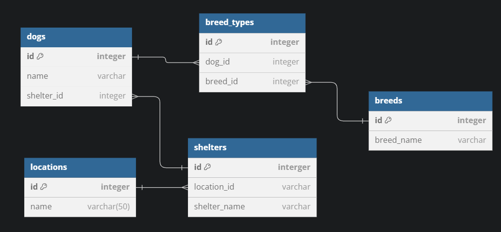
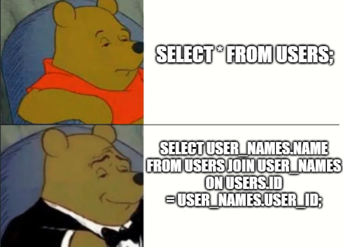

# Creating Our Dog Shelter App

This folder contains a sample showing 5 tables being used to achieve our requirements.

- Phase 1: I want to be able to find all shelters and see their location.
- Phase 2: I want to be able to find all dogs and see what shelter they're at.
- Phase 3: I want to be able to know what breed of dogs are at each shelter.
- Phase 4: I want to be able to remove an entire breed of dog for a shelter.

There are 2 one-to-many relationships and a single many-to-many relationship in this schema.

## Simplicity vs. Complexity

Ultimately, this schema achieves the **same goals** as the example that uses 2 tables, but it is more difficult to maintain and keep track of all the pieces.

Before jumping straight to building a new table, ask yourself if the attribute could simply be another column on an existing table.

## How to Decide
Your application's requirements will help you determine if there is truly a need for an additional table. Oftentimes, adding a column or creating a simple relationship can suffice, reducing the complexity of your database schema.
