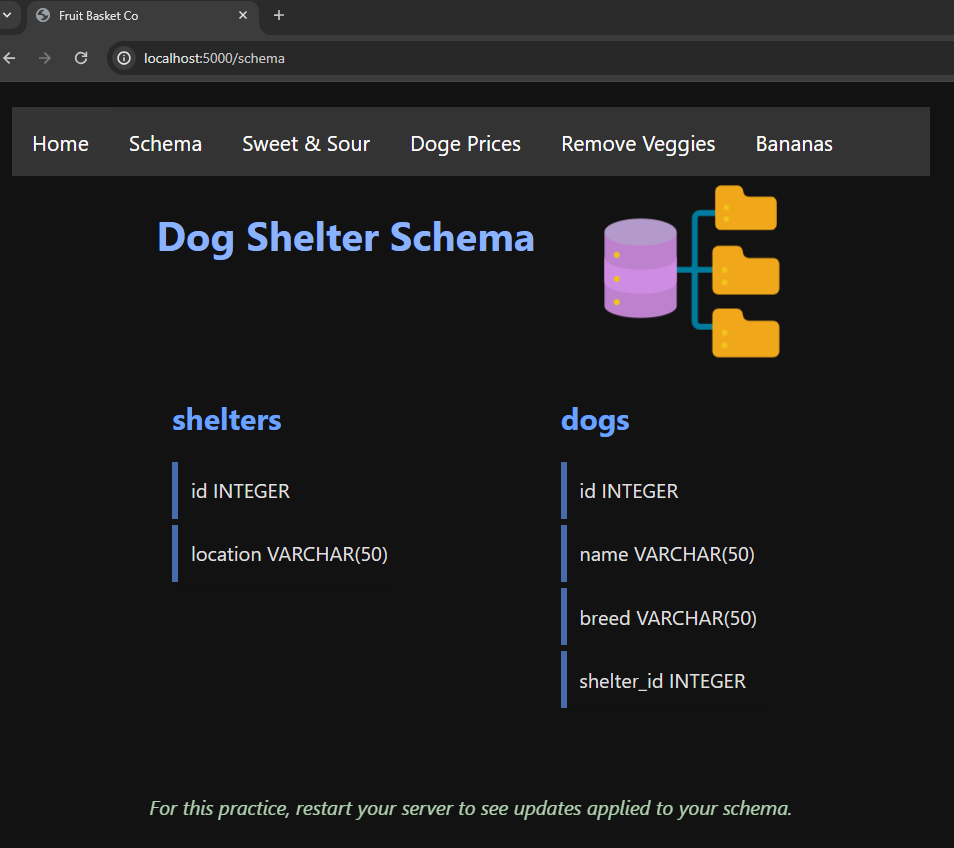
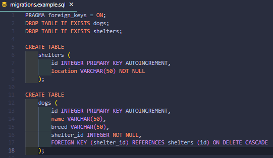
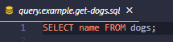

# Will's Fruit Basket Co.

**About This Practice**

- This is an optional practice intended to give you additional SQL practice for your assessment on 3/25.  This project is supposed to be somewhat fun and lighthearted.

- Moreover, this project is intentially being created with Express to let you refamiliarize yourself with Express before we dive right back into it for Week 21 and Week 22.

**There aren't Test Specs**

- You will assess if you've written your SQL correctly by clicking through the app on localhost and seeing if your SQL produces results that match what is specified in the project requirements.
- Feel free to reach out to me if you're unsure about your output.

**Using Express**

- If the integration with Express is throwing you off, you can simply run through the projects requirements creating a db and .sql files in a blank folder on your computer.

### Below is what a page will look in this app, using the dog shelter project in this example.

## Intro

After speaking with a few students in office hours, I got a million dollar product idea: **Fruit Baskets**.

To make it to the big times, I'm going to need the help of some expert SQL devs to devise a schema, and write some queires for our app.

## Overview

I know people like fruit, and I know people like giving gifts. But, *no one* wants to wrap up an individual banana and give it as a present.  So, we're going to get creative and bundle our fruit into "fruit baskets", and sell baskets to consumers.

I know what you're thinking: 'that's not original, Will'. While I agree, we're going to be unique in that the only currency we're going to accept is [dogecoin](https://dogecoin.com/).   Think of the free publicity we'll get by refusing any currency other than doge -- so simple, but so effective.

Alright so let's move to the next section and discuss what we'll need to make this dream into a reality.

## Requirements

1. We'll want to be able to have lots of different types of fruits avaible in our baskets: Oranges, Strawberries, Watermelon, Bananas, and maybe even Tomatos.
2. We'll want to be able to know how fresh our fruit is by marking down how many days old it is when we take inventory (e.g., '1' day old or '2' days old).
3. We'll want to also be able to know what type of flavor the fruit has: is it sour or is it sweet; maybe something inbetween?
4. We'll also want to be able to have customized baskets like a sour fruit basket or maybe even a veggie-fruit basket.

For now, I'm thinking these baskets will work:
- Example:  Will's Rasberry Banana Swirl Basket -- Cost is 2000 Dogecoin
  - 'Banana', '1', 'sweet'
  - 'Rasberry', '3', 'sour'
  - 'Banana', 2, 'sweet'
  - 'Banana', 3, 'sweet'
  - 'Rasberry', 1, 'sour'

- Example: Will's Veggie Fruit Basket -- Cost is 1500 Dogecoin
    - 'Tomato', '2', (let's leave the flavor empty for now until we decide on how to classify a tomato)
    - 'Watermelon' '4', 'sweet'
    - 'Grapefruit',  '2', 'bitter'
    - 'Stawbeerry', '4', 'sweet'

## What We Should Prepare For

Let's get ahead of the curve, and have some working sql to handle the following cases:
1. Sweet and Sour fruits are the most popular.  Let's have a way to find what kinds of fruit we have in stock that have these flavors; we'll also want to check how may days old that fruit is while we're at it.

2. In case we need a cash raise, we'll want to put certain baskets on sale.  Let's have a way to find
basket's that're selling for 1000 to 1999 dodgecoin.  It might make sense to sort these in some order so it's easier to see them in blocks as opposed to a bunch of scattered rows.  We'll also want to check to see what fruits are in these baskets while we're at it.

3. The veggie basket is going to be hit or miss.  Let's have a way to get rid of all of them - essentially delete them from our company's offerings.  We'll throw away the entire basket and whatever fruit is in it since it'll likely be too old to reuse.

4. I'm bullish on bananas.  We'll want a way to look through our fruits and see if we have any bananas in stock, what their flavor is, and how many days old they are.

## Project Setup
Clone this repo and install the dependencies.

You'll be able to run the server with nodemon:
- `npm run dev`

The server contains existing routes that will display the results of your quries in the browser.  The server also handles the creation of the database.  **You will just need to write the SQL.  You do not need to modify any Express**.

Click on the tab that corresponds with the problem you're working on to execute the SQL.  You should see a notification print in your terminal indicating which file was executed.

## Writing Your Code

All code will be written in the "db" directory.  You should not need to modify any files outside of the db directory.  The Express server doesn't always parse SQL comments correctly, so ensure you remove any commented out code from your .sql files.

### Creating Tables
Your tables should be created in `migrations.sql`

### Inserting Data
Your inserts should be added to `seeders.sql`

### Writing Queries
The queries folder `./db/queries` contains a file for each of the 4 scenarios we're preparing for; you should write your sql statements in these files.

### If you're using foreign keys
Make sure to add `PRAGMA foreign_keys = ON;` to the top of the migrations file.

### Examples
Look at the examples folder (./db/examples) to see examples of what your SQL files should look like.

## Creating the DB / Handeling Errors / Resetting your DB
Every time you reset your server the migrations and seeder files will run, effectively resetting your DB.

To apply your migrations (i.e. run your create table commands) you'll need to restart your server.

Your sqlite3 file will be created in the "db" directory.  It will be created automatically when you start your server.

If you receive an error, you'll likely need to stop your server, fix your sql, and restart your server.  Also, if you're stuck and feel something is off, you can right-click and delete your dev.db file to ensure your DB is entirely reset.

## Beyond This Project

If you complete the project, feel free to add more routes and requirements.  Any practice using Express and SQL will be beneficial for weeks 21 and beyond.

Finally, remember to have fun!

---
