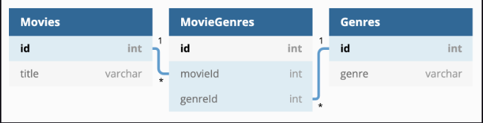

# Setting up and using associations in Sequelize

## Foreign Key Migrations

- One-to-many example



In SQL we would have written something like:

```SQL
CREATE TABLE Tweets (
    -- Other columns defined here
    userId INTEGER,
    FOREIGN KEY (userId) REFERENCES Users(id) ON DELETE CASCADE
);
```

In Sequelize we'll be taking a similar approach, we have to specify the table name and column for our foreign keys.

```js
"use strict";
module.exports = {
  up: async (queryInterface, Sequelize) => {
    await queryInterface.createTable("Tweets", {
      // Other columns defined here
      userId: {
        type: Sequelize.INTEGER,
        references: {
          model: "Users", // <- Misleading name, we have to give it the TABLE name as a string
          key: "id",
        },
        onDelete: "cascade",
      },
    });
  },
  down: async (queryInterface, Sequelize) => {
    await queryInterface.dropTable("Tweets");
  },
};
```

- Many-to-Many Example


- Step 1: Make sure the 2 tables you are joining already exist!

```bash
npx sequelize model:generate --name Movie --attributes title:string
npx sequelize model:generate --name Genre --attributes genre:string
```

- Step 2: Generate model/migration for the join table

```bash
npx sequelize model:generate --name MovieGenres --attributes movieId:integer,genreId:integer
```

- Step 3: Edit the migration file on the join table

```js
// up function in the migration file to create the MovieGenres table
up: async (queryInterface, Sequelize) => {
  await queryInterface.createTable('MovieGenres', {
    id: {
      allowNull: false,
      autoIncrement: true,
      primaryKey: true,
      type: Sequelize.INTEGER
    },
    movieId: {
      type: Sequelize.INTEGER,
      allowNull: false,
      references: { model: 'Movies' }
    },
    genreId: {
      type: Sequelize.INTEGER,
      allowNull: false,
      references: { model: 'Genres' }
    },
  });
},
```

## Defining Associations on the Model


```js
class Person extends Model {
  static associate(models) {
    Person.hasMany(
      models.Job,
        { foreignKey: 'personId', onDelete: 'CASCADE',  hooks: true }
    );
  }
}
```

```js
class Job extends Model {
  static associate(models) {
    Job.belongsTo(
      models.Person,
        { foreignKey: 'personId' }
    );
  }
}
```


```js
class Book extends Model {
  static associate(models) {
    Book.belongsToMany(
      models.Reader, // model we're associating Book with
        { through: models.BookReader, // model for the join table
          foreignKey: 'bookId', // foreign key on join table that references this model
          otherKey: 'readerId'  // foreign key on join table that references the other model
        }
    );
  }
}
```

```js
class Reader extends Model {
  static associate(models) {
    Reader.belongsToMany(
      models.Book,
        { through: models.BookReader,
          foreignKey: 'readerId',
          otherKey: 'bookId'
        }
    );
  }
}
```

### PRACTICE - Foreign Key Migrations

## Lazy/Eager Queries

### Lazy loading with `get` instance methods

Scenario, Cat model belongsTo the Owner model; Cat model hasMany of the Toy model

```js
const cat = await Cat.findByPk(id);
// finds cat with specific primary key id
const owner = await cat.getOwner(); // Note Owner is singular here
// object with information about the cat's single owner
```

```js
const cat = await Cat.findByPk(id);
// finds cat with specific primary key id
const toys = await cat.getToys();  // Note Toys is plural here
// an array of objects with information of the cat's many toys
```

### Eager loading

We do this by using the `include` key inside of the query options object

```js
const cat = await Cat.findByPk(id, {include: Owner});
```

- [Link to Sequelize API docs](https://sequelize.org/api/v6/class/src/model.js~model#static-method-findAll)
- [Link to Sequelize Eager Loading Guide](https://sequelize.org/docs/v6/advanced-association-concepts/eager-loading/)

### PRACTICE - lazy/eager loading

## Insert with Associations

Scenario: We have a one-to-many relationship between 2 models `Author` and `Book`

- An author has many books
- A book belongs to an author

### Option 1 - `create<ModelName>` instance method

```js
const author = await Author.findOne({ where: { name: "C.S Lewis" } });
    // returns Author: {
        // id: 1,
        // name: "C.S. Lewis"
    // }

await author.createBook({ title: "Prince Caspian" });
    // created book is automatically stored with an authorId matching the id of the associated author

const book = await Book.create({ title: "Hatchet" });
    // creates a book with no associated author

await book.createAuthor({ name: "Gary Paulsen" });
    // creates an author and automatically associates it to the book
    // the book record is updated to associate it with the new author
```

### Option 2 - `create` method with nested data

```js
await Author.create({
    name: "Amy Tan",
    books: [
        { title: "The Joy Luck Club" },
        { title: "Where the Past Begins" }
    ]
},
// { include: [ Book ] } optional options object as second argument
)
```

### Option 3 - `add<Model>` instance method

Scenario: Many-to-Many relationship between `Reader` and `Book` models

```js
// Create or find instances of readers and books
const reader1 = await Reader.create({ userName: "SuperReader109" });
const reader2 = await Reader.create({ username: "Reader McReady" });

const book1 = await Book.create({ title: "The Wind in the Willows" });
const book2 = await Book.create({ title: "Where the Wild Things Are" });

// Add association between a single reader and book
await reader1.addBook(book1);

// Add association between one book and multiple readers
await book2.addReaders([ reader1, reader2 ]);
```

## Dynamic Seeding

There are four steps to follow to create seeds dynamically:

- Import the models into the seeder file
- Establish a single data source for the seeds
- Find the data that you want to create dynamic seeds for
- Insert related data using the found data as foreign key values

```js
'use strict';

// 1. Import the models into the seeder file
const { Person, Job } = require('../models');

// 2. Establish a single data source for the seeds
const personJobs = [
  {
    fullName: 'John Doe',
    jobs: [
      { company: 'Starbucks', role: 'Barista'},
      { company: 'Geico', role: 'Insurance Salesperson'}
    ]
  },
  {
    fullName: 'Jane Doe',
    jobs: [
      { company: 'WNBA', role: 'Basketball Player'}
    ]
  }
]

module.exports = {
  up: async (queryInterface, Sequelize) => {

    // 3. Find the data that you want to create dynamic seeds for
    for (let personInfo of personJobs) {
      const { fullName, jobs } = personInfo;
      const person = await Person.findOne({ where: { fullName } });

      // 4. Insert related data using the found data as foreign key values
      for (let jobInfo of jobs) {
        await Job.create({ ...jobInfo, personId: person.id });
      }
    }
  },

  down: async (queryInterface, Sequelize) => {
    // Iterate over the personJobs array, then over the nested array of
    // jobs, destroying each job record as it is encountered.
    for (let personInfo of personJobs) {
      const { fullName, jobs } = personInfo;
      const person = await Person.findOne({ where: { fullName } });

      for (let jobInfo of jobs) {
        await Job.destroy({ where: { ...jobInfo, personId: person.id } });
      }
    }
  }
};
```

## Order Query Results

### Ordering by a single attribute

```js
const student = await Student.findByPk(5);
const submissions = await student.getSubmissions({
    order: [['createdAt', 'DESC']]
});
// Makes the following SQL query:
// SELECT 'Submissions'.* FROM 'Submissions' WHERE 'studentId' = ? ORDER BY 'createdAt' DESC;
```

### Ordering by multiple attributes

```js
const teacher = await Teacher.findByPk(2);
const assignments = await teacher.getAssignments({
    order: [ ['name', 'ASC'], ['createdAt', 'DESC'] ]
});
// Makes the following SQL query:
// SELECT 'Assignments'.* FROM 'Assignments' WHERE 'teacherId' = ? ORDER BY 'name' ASC, 'createdAt' DESC;
```

### Ordering by an attribute on associated data

```js
const teacher = await Teacher.findByPk(2);
const assignments = await teacher.getAssignments({
    // include associated Course data with each assignment
    include: { model: Course },
    // order results by course title, then assignment name
    order: [ [Course, 'title'], ['name', 'ASC'] ]
});
```

### PRACTICE - ORDERING
