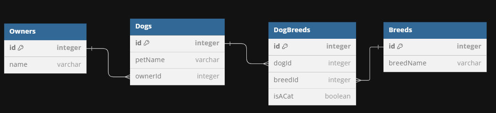

# Assessment Prep

## Step 1
You are given working models and migrations for Owners, Dogs, and Breeds.

Your task is to create any necessary models and migrations so that the schema reflects the diagram below.

You may not modify any of the _existing_ migration files.

## Step 2

After creating the associations, create a route handler that will allow owners to add new dogs.

The route should be at the path below:

`POST /owners/:ownerId`

The body of the request should be the following format:

`{"petName": "Fido"}`

The route's response should be in the following format:
{"petName": "Fido", "ownerId": 1}

### Test your route using postman

If your associations are set up correcly, the owner should now have a dog that references the oweners id.

## Step 3

Create a route to handle GET requests at `/dogs/breeds`.

This route should get all of the dogs, and eagerly load their breeds.

The response should return all of the dogs with their associated breeds.  The results should be ordered alphabetically by the dog's name.
