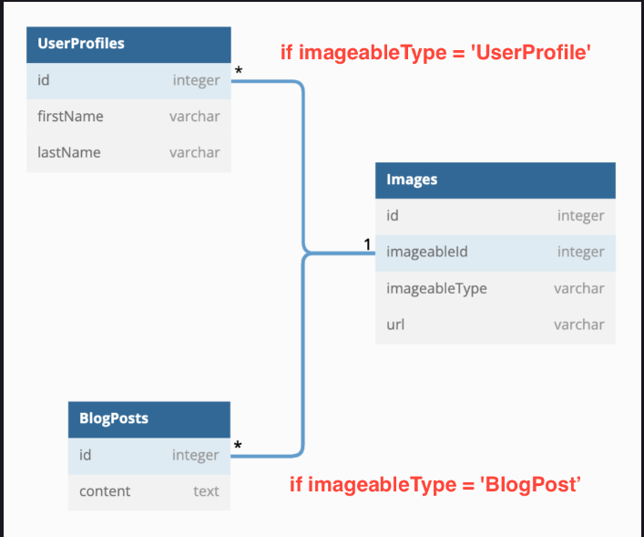

# OOP Revisited: Polymorphism

<details><summary>What are the 4 pillars of OOP?</summary>
<li>Abstraction</li>
<li>Encapsulation</li>
<li>Inheritance</li>
<li>Polymorphism</li>
</details>
<br>
Polymorphism in OOP is the idea that one method can have a different implementation even though it has the same name because the result is equivalent.

- We can see this with the `.toString()` method that exists on the `Object` class

## Polymorphism in Sequelize

- We can have one table that references multiple other tables!



### UserProfile Model

```javaScript
class UserProfile extends Model {
  associate(models) {
    UserProfile.hasMany(models.Image, {
      foreignKey: 'imageableId',
      constraints: false,  // we need this to make the table polymorphic, it disables foreign key constraints
      scope: {
        imageableType: 'UserProfile' // this is adding a 'WHERE' clause to this relationship
      }
    });
  }
}
```

### BlogPost Model

```javaScript
class BlogPost extends Model {
  associate(models) {
    BlogPost.hasMany(models.Image, {
      foreignKey: 'imageableId',
      constraints: false,
      scope: {
        imageableType: 'BlogPost'
      }
    });
  }
}
```

### Image Model

```javaScript
class Image extends Model {
  getImageable(options) {
    if (!this.imageableType) return Promise.resolve(null);

    const methodName = `get${this.imageableType}`;
    return this[methodName](options); //image.getUserProfiles(options) || image.getBlogPosts(options)
  }
  associate(models) {
    Image.belongsTo(models.UserProfile, {
      foreignKey: 'imageableId',
      constraints: false
    });
    Image.belongsTo(models.BlogPost, {
      foreignKey: 'imageableId',
      constraints: false
    });
  }
}
```

## Let's talk about projects!

- Goals
  - This will be the backend for the Mod 5 project
  - Improve debugging skills
  - Test your knowledge of what we've taught up to this point
  - Emulate a real-world project sprint
- Expectations
  - Daily stand-ups as a small group
  - Asking *GOOD* questions via Discord
  - All backend endpoints working as specified in Documentation
  - At least 2 commits a day: commits during and outside of class