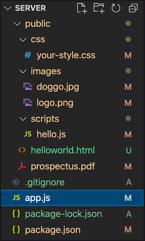

# Password Security & Serving Static Files with Express

## Storing Passwords

Important rules for storing passwords:

1. Never store passwords as plain text
2. Never store passwords as plain text
3. Never store passwords as plain text

- Anyone that is able to access the production database would be able to see any user's password. Although we don't intend on letting normal users of our applications have access to that database, we have to plan for that possibility.
  - Murphy's law: Anything that can happen will happen eventually.
- Additionally, in larger companies many devs might have access to the database, and if any one of those devs are disgruntled, that could pose a major security risk
- A lot of major companies have broken this rule, which is part of the reason they suffer costly security breaches:
  - clubpenguin.com (throwback)
  - AshleyMadison.com (lol)
  - t-mobile.net
  - macys.com

Today, the standard for storing passwords securely involves both *hashing* and *salting*.

- Hashing in pseudo-code:

```js
function hashingFunction(input) {
    // lots of hidden logic to transform the input into the output
    return output
};

const input1 = "password";
const input2 = "newPassword";
const input3 = "password"; // same as input1

const hashedPasswords = [
    hashingFunction(input1), // "13p98oihgaskdhjf"
    hashingFunction(input2), // "fh23984hdk1o3"
    hashingFunction(input3)  // "13p98oihgaskdhjf" // same as output of input1
];

// NOTE: Hashing functions for passwords are much more complex than this example!
```

- Hashing passwords adds an extra layer of security.
  - If a hashed password is leaked, it is difficult (although not impossible) to figure out the original plain-text password.

### Rainbow Table Attacks

Rainbow tables are tables made up of common plain-text passwords and their hashed outputs:


How malicious actors can use them:

1. Compare each leaked hashed password to hashed passwords in the hash table.
2. If there is a match, look at the corresponding plain-text password for the matched record.
3. Hack into that user account with the plain-text password.

How can we, as developers, prevent these type of attacks?

- NEVER send hashed passwords to the client/front end in ANY circumstance.
- Salt passwords before hashing them

### Salting Passwords

- A *salt* is a string of characters added to a password
  - Often 32 characters or longer
  - Can be added to the beginning, middle, or end of a password
  - Added *before* the password is hashed

Salting in pseudo-code:

```js
let salt = generateRandomString();
let salted = salt+plainText
let hashed = hashingFunction(salted);
```

### User Authentication

When you store a user's salted and hashed password in the database, the only time you should ever need it is when you need to authenticate a user who is trying to log in.

- To that end, we will be creating a default scope on the `User` model that excludes the hashed password in the phase 3 of the Authenticate Me walkthrough today!
- We will be using the `bcryptjs` package to salt, hash, and compare passwords.
  - bcrypt's `hashSync` method will generate a salted and hashed password
    - takes a required parameter of a plain-text password, and defaults to using a salt of 10 random characters (unless you define a different number as the second optional argument)
  - bcrpyt's `compareSync` method compares the plain-text string typed into the login form, with the salted and hashed password from the database, and returns a boolean indicating whether or not they are equivalent.

```js
// generates salted + hashed password, second arg is optional
const saltedAndHashedPassword = bcrypt.hashSync(plainTextPassword, 32);

// returns boolean as to whether passwords match
const isLegit = bcrypt.compareSync(plainTextPassword, saltedAndHashedPassword);
```

## Serving Static Files in Express

We can use the built-in `express.static()` middleware function to serve static assets in Express

- express.static() takes in the relative path to the files you want to serve up.
  - do not start the path with a `/`
- we will use an `app.use()` to connect this middleware to the rest of our application, just like any other middleware

Example:



```js
// app.js
app.use('/static', express.static('public')); // serving up files from the 'public' folder when we get requests that start with '/static'
```

<details><summary>Using the above code + file structure, what request would I have to send to the server to get the `doggo.jpg` image?</summary>
GET /static/images/doggo.jpg

- urlPrefix is /static
- relative file path in the public folder is /images/doggo.jpg
</details>

## Kanban Boards

Set them up and use them! It will help with your daily stand-ups that will be happening when we get back from the break

- They give you quick visibility into the progress of your tasks
